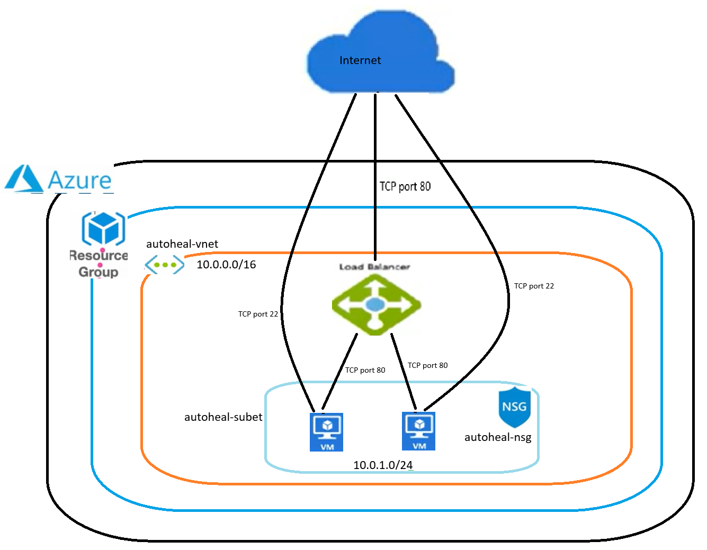

# Auto-Healing-Azure
Terraform - Dev - Auto-healing Web Tier (Azure) — N+1 VMSS with Load Balancer

DISCLAIM
ALL CODES IN THIS REPOS DO NOT WARRANTY IN ANY KIND OF HOW THEY ARE USED. IT IS YOUR OWN RISK. THERE IS NO MAINTENANCE EITHER.

## Goal
The codes are for single purpose which is auto-healing web tier that tolerate losing any single VM without downtime.

## Diagram

## What this repo includes
- VM Scale Set (VMSS) with **automatic instance repair** using LB health probe (self-healing within 10 minutes).
- Standard public **Load Balancer** with probe & rule (traffic spread across instances).
- **N+1** capacity by default (`min_size = 2`) so losing one instance preserves service.
- **Static NGINX page** served from cloud-init with message: `welcome - this is autohealling page`.
- Idempotent Terraform IaC (re-run shows no changes).

## Monthly Cost Estimate (AUD, N+1 setup, 2 instances, most economical options) 
Below is cost compaision for own reference only. It doesn't imply anything nor does it represent anything.

Running full resources 24/7 in Azure (Standard LB + 2 x Standard_B1ms + Public IP + storage) will likely exceed AUD $20 / month. 
Ways to keep costs close enought around AUD 20 for demonstration:
    Use smallest possible SKU (e.g. Standard_B1ls if available) — lower cost.
    Run resources only during working hours and destroy afterwards.
    Use terraform plan only for assessment (no real costs).

 |Cost Component | Azure | AWS |
 | :--- | :---: | ---: |
 | Compute (2 x B1s / t4g.micro) | ~ $18 (2 × $9) | ~ $15 (2 × $7.5) |
 | Load Balancer | Basic LB ~ $7 | ALB ~ $20 (NLB ~ $15) |
 | Storage (OS disks) | ~ $3 (2 × $1.5, 30GB SSD) | ~ $2 (EBS gp3 30GB × 2) |
 | Data Transfer (10GB outbound) | ~ $1 | ~ $1 |
 | Public IP / DNS | Included in LB | Included in ALB |
 | Total (Monthly, AUD) |  ~ $29 | ~ $38  |

## Files & modules
modules/network — VNet, subnet, NSG.
modules/lb — Public IP, Standard LB, backend pool, probe, rule.
modules/compute — VMSS with cloud-init installing nginx and wiring into LB.

## Assumptions & notes
Single-region: all resources are in one region and a single subnet (For the above mentioned purpose and scope does not require global or cross regions.).
SSH key: provide a valid ssh_public_key_path to avoid file() errors.
Health check: VMSS uses LB probe for instance health; automatic repair is enabled.

## Quickstart
1. Provider:
   # Please review and update subscription_id for which the deployment is targeted/utilised. 

2. Input variables:
   # Please review all items in terraform.tfvars file and set them up accordingly.
   
   # Brief description for each of variable
   var_name = prefix
   # The value will be prefixed in front of the resouce name as they are created by relevant modules. 
   
   var_name = location 
   # This dictates which region all resouces to be created in 

   var_name = resource_group_name 
   # Log on to Azure and locate/find the appropriate target resouce group for deployment. Important note - if unsure, it is best is to create a blank resource group with appropriate RBAC. All required resources will be created in this intended resouce group name.

   var_block_name = tags
   # Self explaintory. They are for tagging all resouces.

   var_name = manage_resource_group_tags
   # This is control flag if you wish to update the tag of the target resouce group name. Currently it is set to be skipped.
   
   var_name = vm_size 
   # This is size of linux VM to be crated by compute module. So review the available VM size suitable for your need. The Standard_B1ms is choosen simply it is lightweight, burstable workloads, as they offer a balance of performance and most economy choice.

   var_name = ssh_public_key_path 
   # Generate ssh pair key. The compute module will setup linux VM with using ssh pair key authentication to install and setup NGINX so it will need to know where the ssh public key is located. Plase specifying the path of the folder storing this ssh public key. Please protect private ssh key.

3. Init & plan:

   terraform init
   terraform plan -var-file="<path>/terraform.tfvars" -out="<path>/tf.plan"
   terraform show -no-color "<path>tf.plan" > "<path>plan.txt"

4. Apply (You need to know 100% of what you are aboiut to do before execution):
   terraform apply "<path>/tf.plan"
